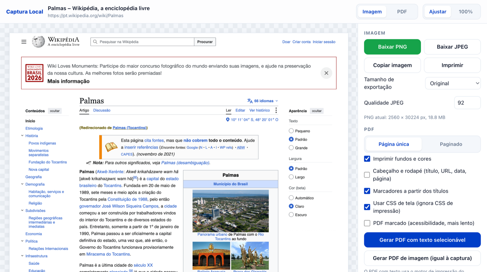
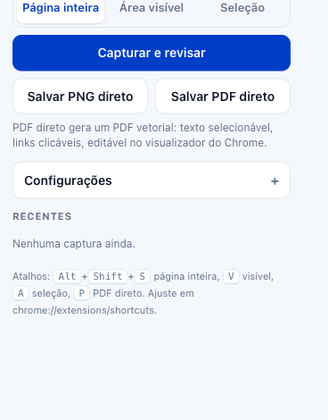
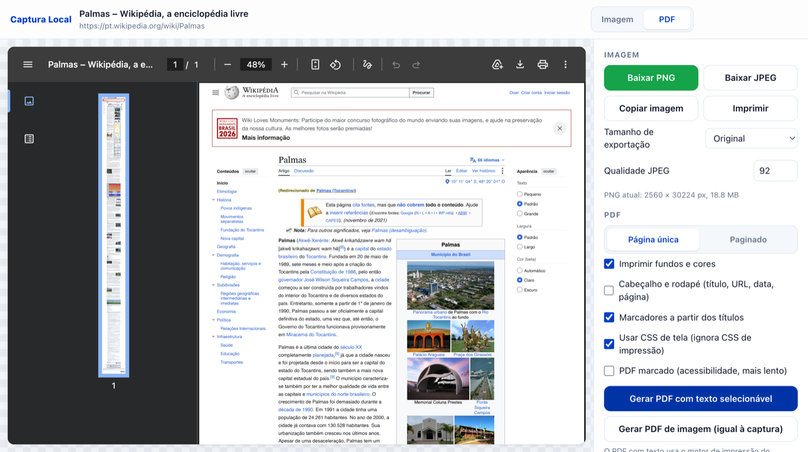

# Captura Local

**Extensão de Chrome, código aberto e 100% local, para capturar páginas inteiras e salvar em
PNG, JPEG ou PDF com texto selecionável.** Alternativa gratuita ao FireShot, GoFullPage,
Awesome Screenshot, Nimbus Capture e outras extensões de captura de tela, sem conta, sem
upload, sem anúncios, sem versão Pro.

> **English summary.** Captura Local is an open-source, privacy-first Chrome extension that
> takes **full-page screenshots** and saves them as **PNG, JPEG or a vector PDF with
> selectable, searchable text, clickable links and bookmarks**. It works entirely on your
> machine (nothing is uploaded), has no account, no ads and no paid tier. A free alternative
> to FireShot, GoFullPage, Awesome Screenshot, Nimbus Capture, Scrnli and similar
> screenshot extensions. Released into the public domain (Unlicense).
> [Jump to the English section](#english).

## Por que existe

O FireShot resolve o problema, mas a versão gratuita limita o PDF e as funções mais úteis ficam
no plano pago. Esta extensão foi feita para uso próprio e publicada para quem quiser: ela usa
o próprio motor de impressão do Chrome (via protocolo DevTools) para gerar um PDF de verdade,
com texto que dá para selecionar, pesquisar, copiar e anotar no visualizador do Chrome, e
fotografa a página inteira de uma vez, sem rolar e sem costura visível.

Não é publicada na Chrome Web Store de propósito: instala-se em modo desenvolvedor, direto
desta pasta, e por isso não depende de revisão, atualização automática nem de nenhum servidor.

## O que faz

**Captura**
- Página inteira, do topo ao rodapé, incluindo o que está fora da tela.
- Área visível (só o que aparece na janela).
- Seleção: arraste um retângulo sobre a página; `Esc` cancela.
- Rola a página antes da captura para disparar imagens com carregamento preguiçoso (lazy).
- Revela blocos que só aparecem com animação de entrada ao rolar (Framer, Webflow, AOS,
  GSAP, Elementor). Sem isso, essas seções saem em branco — e no PDF nem o texto vai junto.
- Cabeçalhos e barras fixas aparecem uma vez só, no lugar certo.
- Escala 1x, 2x (Retina) ou 3x, ou a escala automática da tela.
- Dois motores para página inteira: **DevTools (sem costura)**, o padrão, e **rolagem e
  costura**, alternativo para sites que se comportam mal com o primeiro.

**Salvar como**
- **PNG** e **JPEG** (qualidade ajustável), no tamanho original ou reduzido a 50% ou 25%.
- **PDF com texto selecionável** (página inteira):
  - **Página única**: uma página do tamanho exato do site, como o FireShot faz.
  - **Paginado**: A4, Carta, Ofício ou A3, retrato ou paisagem, margem em mm.
  - Texto pesquisável e selecionável, links clicáveis, marcadores gerados dos títulos (H1 a H6).
  - Fundos e cores, cabeçalho e rodapé com título, URL, data e número da página.
  - Opção de usar o CSS de tela (ignora o CSS de impressão do site, que costuma esconder coisas).
  - Opção de manter o layout de desktop no modo paginado (reduz a escala em vez de deixar o
    site se reorganizar para a largura do papel).
  - Opção de converter elementos fixos, senão o Chrome repete o cabeçalho fixo em toda página.
  - PDF marcado (tagged) para acessibilidade.
- **PDF de imagem**: um JPEG por página, exatamente como a captura. Serve para área visível e
  seleção, ou para sites que renderizam diferente na impressão.
- **Copiar** a imagem para a área de transferência e **imprimir**.
- **Abrir no Chrome**: abre o PDF no visualizador nativo, onde dá para selecionar texto,
  marcar, desenhar, preencher e salvar.

**Como acionar**
- Popup na barra de ferramentas, com botões **Capturar e revisar**, **Salvar PNG direto** e
  **Salvar PDF direto**.
- Atalhos: `Alt+Shift+S` página inteira, `Alt+Shift+V` área visível, `Alt+Shift+A` seleção,
  `Alt+Shift+P` página inteira direto em PDF (ajuste em `chrome://extensions/shortcuts`).
- Menu do botão direito na página, com os mesmos cinco comandos.

**Organização**
- Arquivos vão para `Downloads/Capturas/` (subpasta configurável), nomeados como
  `Captura 012 - Título da página - dominio.com.png`.
- Opção "Perguntar onde salvar".
- Histórico das últimas 8 capturas no popup, guardado só no seu computador.
- Tema claro e escuro.

## Privacidade

Nenhuma requisição de rede. A extensão não tem servidor, não coleta dados, não usa analytics
e não pede login. As capturas ficam em `chrome.storage.local` até saírem do histórico. Dá para
conferir: o código inteiro está nesta pasta, sem build, sem minificação e sem dependências.

As permissões pedidas e o motivo:

| Permissão | Para quê |
|---|---|
| `debugger` | conectar o protocolo DevTools à aba: é o que permite fotografar a página inteira de uma vez e gerar o PDF com texto |
| `activeTab`, `tabs`, `scripting`, `<all_urls>` | ler o tamanho da página, rolar antes da captura, desenhar a seleção, capturar a área visível |
| `downloads` | salvar os arquivos na pasta de Downloads |
| `storage`, `unlimitedStorage` | guardar configurações e o histórico de capturas |
| `contextMenus`, `notifications`, `clipboardWrite` | menu do botão direito, aviso de erro, copiar imagem |

Enquanto a captura roda, o Chrome mostra a faixa "Captura Local começou a depurar este
navegador". É o comportamento padrão da permissão `debugger` e some ao terminar.

## Instalação (modo desenvolvedor)

1. Baixe ou clone este repositório.
2. Abra `chrome://extensions`.
3. Ligue **Modo do desenvolvedor** (canto superior direito).
4. Clique em **Carregar sem compactação** e escolha a pasta do repositório.
5. Fixe o ícone na barra (menu de extensões, alfinete).

Depois de editar qualquer arquivo, clique no botão de recarregar do card da extensão.

Funciona em Chrome, Edge, Brave, Vivaldi, Opera e outros navegadores Chromium, versão 116 ou
mais recente. Não funciona em Firefox nem Safari.

## Comparação com o FireShot

| Função | FireShot Lite | FireShot Pro | Captura Local |
|---|---|---|---|
| Página inteira, visível, seleção | sim | sim | sim |
| PDF de página única | sim | sim | sim |
| PDF multipágina (A4, Carta...) | não | sim | sim |
| Texto selecionável e pesquisável no PDF | limitado | sim | sim |
| Links clicáveis no PDF | sim | sim | sim |
| Marcadores no PDF | não | sim | sim |
| Cabeçalho e rodapé no PDF | não | sim | sim |
| Elementos com rolagem interna | não | sim | não |
| Todas as abas num PDF | não | sim | não |
| Editor de anotações | não | sim | não (abra o PDF no Chrome) |
| Upload para redes e nuvem | sim | sim | não, de propósito |
| Anúncios | sim | não | não |
| Preço | grátis | pago | grátis, domínio público |

## Como funciona (para quem for mexer)

Sem build step. Manifest V3. JavaScript puro.

| Arquivo | Papel |
|---|---|
| `manifest.json` | permissões, atalhos, popup, service worker |
| `background.js` | service worker: orquestra capturas, fala com o DevTools Protocol (`chrome.debugger`), injeta scripts na página, gera o PDF vetorial com `Page.printToPDF`, guarda o resultado em `chrome.storage.local` |
| `popup.html/js` | popup com modos, ações, configurações e recentes |
| `result.html/js` | página de resultado: costura as fatias num canvas, exporta PNG/JPEG, pede o PDF vetorial ao service worker, monta o PDF de imagem |
| `lib/common.js` | configurações padrão, nomes de arquivo, utilitários compartilhados |
| `lib/pdf-image.js` | gerador mínimo de PDF a partir de JPEGs (sem dependências) |
| `style.css` | tema claro/escuro compartilhado |
| `icons/` | `icon.svg` é a fonte única; os PNGs saem dele com `cd icons && for s in 16 32 48 128; do rsvg-convert -w $s -h $s icon.svg -o icon$s.png; done` (nunca editar um tamanho à mão) |

Detalhes que custaram tempo e não devem ser desfeitos:

- **`Page.captureScreenshot` com `captureBeyondViewport`** captura a página inteira sem rolar.
  É fatiado em pedaços de até 6000 px físicos porque o Chrome falha em clips muito altos.
- Depois de vários desses captures o Chrome **deixa a barra de rolagem da página escondida**
  (o `clientWidth` cresce). Só volta ao normal com `Emulation.setDeviceMetricsOverride`
  explícito seguido de `clearDeviceMetricsOverride` (função `restoreViewport`).
- Na impressão, **`100vh` vira a altura do papel**. Numa página única isso faria um bloco
  `min-height:100vh` ocupar o PDF inteiro. `fnFreezeVh` troca `vh`/`vmin`/`vmax` por px da tela
  em todas as folhas de estilo acessíveis (as de outra origem não dão para ler) e `fnUnfreezeVh`
  desfaz.
- O layout de impressão pode sair alguns px mais alto que o de tela. Em modo página única o
  código conta as páginas do PDF gerado e, se vazou, **reimprime 3% e depois 12% mais alto**.
- `Page.printToPDF` é lido por stream (`IO.read`). Cada pedaço vem em base64 próprio e o
  Chrome nem sempre devolve o tamanho pedido, então cada pedaço é decodificado e o conjunto é
  recodificado uma vez no fim. Concatenar o base64 dos pedaços quebra.
- `chrome.tabs.captureVisibleTab` aceita no máximo 2 chamadas por segundo; o motor de rolagem
  espera 600 ms entre quadros.
- Num teste automatizado, o service worker não recebe `chrome.runtime.sendMessage` enviado por
  ele mesmo; chame `startCapture()` direto.

## Limitações conhecidas

- Não captura páginas internas do Chrome (`chrome://`), a Chrome Web Store nem PDFs abertos no
  visualizador.
- Se o DevTools (F12) estiver aberto na aba, o `chrome.debugger` não conecta. Feche e tente de novo.
- Sites que rolam dentro de uma `div` (não no documento) saem só com a área visível.
- A seleção é limitada à área visível (sem rolagem durante o arrasto).
- Imagens acima de ~240 megapixels são reduzidas para caber no limite de canvas do Chrome; o
  aviso aparece na página de resultado.
- Não há editor de anotações (setas, texto, blur). Para anotar, abra o PDF no Chrome ou o PNG
  no Pré-Visualização do macOS.
- O PDF com texto é gerado na aba original, que precisa continuar aberta na mesma URL.

## Licença

Domínio público, via [Unlicense](LICENSE). Sem copyright, sem atribuição obrigatória: copie,
modifique, venda, redistribua. Projeto pessoal de Cassio Prado, sem suporte formal; issues e
pull requests são bem-vindos.

---

## English

**Captura Local** ("Local Capture") is a Chrome extension that captures **full-page
screenshots** and saves them as **PNG, JPEG or PDF**. Everything runs locally: no server, no
account, no analytics, no ads, no Pro tier. Public domain (Unlicense).

It is meant as a free, open-source replacement for **FireShot, GoFullPage, Awesome
Screenshot, Nimbus Capture, Scrnli, Full Page Screen Capture** and similar webpage screenshot
extensions, with one feature most of them charge for: a **real vector PDF** produced by
Chrome's own print engine, with **selectable and searchable text, clickable links and
bookmarks**, that you can annotate in Chrome's built-in PDF viewer.

### Features

- Capture the **entire page** (including everything below the fold), the **visible area**, or
  a **drag-selected region**.
- Pre-scrolls the page to trigger lazy-loaded images; fixed headers appear once, in place.
- Reveals blocks hidden behind scroll-in animations (Framer, Webflow, AOS, GSAP, Elementor),
  which would otherwise come out blank.
- 1x, 2x (Retina) or 3x scale. Two full-page engines: DevTools Protocol (no stitching seams,
  default) and scroll-and-stitch (fallback).
- **PNG / JPEG** export (adjustable quality, optional 50% / 25% downscale), copy to clipboard,
  print.
- **Vector PDF** (full page): single page sized exactly to the site, or paginated A4 / Letter /
  Legal / A3, portrait or landscape, custom margins, background graphics, header/footer with
  title, URL, date and page numbers, document outline from headings, tagged PDF, screen CSS
  instead of print CSS, keep-desktop-layout scaling, and un-fixing of `position: fixed`
  elements so they don't repeat on every page.
- **Image PDF**: one JPEG per page, pixel-identical to the screenshot (works for visible-area
  and selection captures too). Built with a tiny dependency-free PDF writer.
- Trigger from the toolbar popup, keyboard shortcuts (`Alt+Shift+S` full page, `V` visible,
  `A` selection, `P` straight to PDF) or the right-click context menu.
- Files go to `Downloads/Capturas/` (configurable) named `Captura 012 - Page title - host.png`;
  optional "ask where to save". Local history of the last 8 captures. Light and dark theme.

### Install (developer mode)

1. Download or clone this repository.
2. Open `chrome://extensions`, enable **Developer mode**.
3. Click **Load unpacked** and pick the repository folder.
4. Pin the icon. Works on Chrome, Edge, Brave, Vivaldi, Opera and other Chromium browsers
   (116+). Not available for Firefox or Safari.

The UI is in Brazilian Portuguese; the code comments are too. The `debugger` permission shows
Chrome's "started debugging this browser" bar during a capture; that is expected.

### Known limitations

No annotation editor (open the PDF in Chrome to annotate), no capture of inner scrolling
`div`s, no scrolling during selection, no "all tabs to one PDF". Cannot capture `chrome://`
pages or the Web Store. Close DevTools on the tab before capturing.

### License

[Unlicense](LICENSE): public domain, no copyright, no attribution required.
